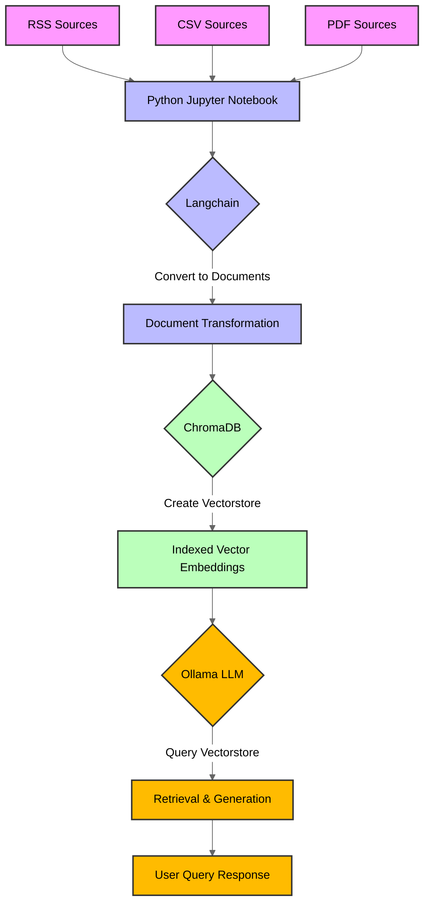

# Custom RAG for Cyber Threat Intel

Experimental code for building a custom RAG model for CTI. 

<!--  -->

**References:**
* https://www.youtube.com/watch?v=0zgYu_9WF7A
* https://www.youtube.com/watch?v=75uBcITe0gU&t=565s

